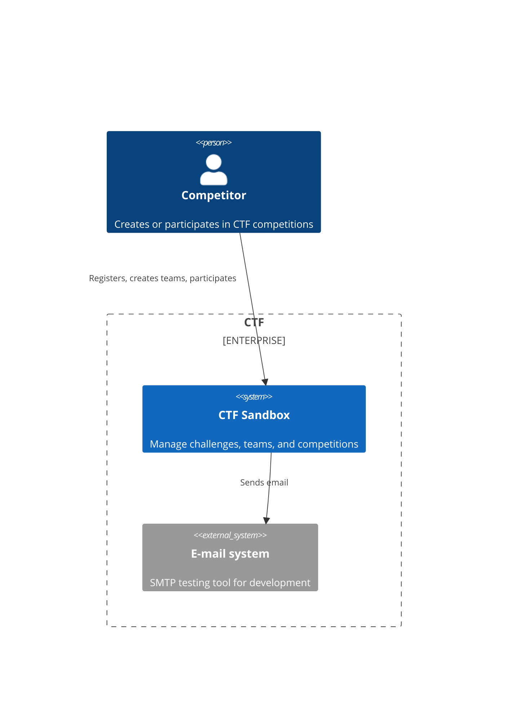
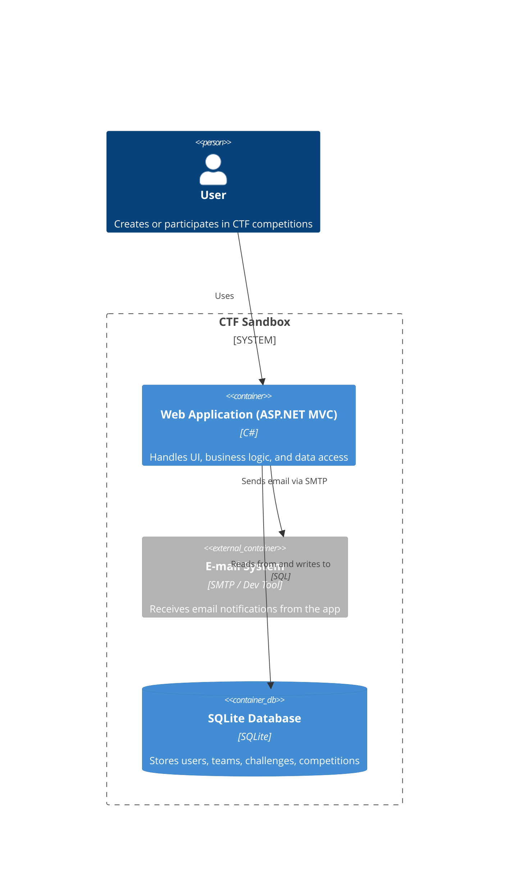

## System Name
ctf-sandbox

## Contributors
- [Stéphane Denommé](https://github.com/CurlyFire)

## Licence
MIT

## Background Context
This is a TDD Sandbox to work out the kinks to migrate from a big ball of mud legacy project to a microservice hexagonal architecture with unit tests that respect the modern test pyramid.

The main goals of this project are:
- ✅ Generate a big ball of mud to represent the initial legacy application
- 🔄 Migrate to a microservices hexagonal architecture with unit tests
- 🔄 Get my DDD Bounded Contexts framed correctly
- 🔄 Develop all this code in TDD, following [Valentina Jemuovic's](https://github.com/valentinajemuovic) suggested way.  Her site is [Optivem journal](https://journal.optivem.com).  You can also follow her on [LinkedIn](https://www.linkedin.com/in/valentinajemuovic)

The big ball of mud was created with github copilot agent mode using Claude Sonnet 3.5.  I just wanted to create something that worked without being clean.

## System use cases
- As a competitor, I want to sign up for future CTF competitions
- As a competitor, I want to create a team of competitors
- As a team leader, I want to assign competitors to my team
- As a team leader, I want to particate in a CTF competition
- As a challenge creator, I want to create CTF challenges
- As a CTF organizer, I want to create upcoming CTF competitions
- As a CTF organizer, I want to assign challenges to an upcoming CTF competition
- As a CTF organizer, I want to assign teams to an upcoming CTF competition

## External systems
- Email using [mailpit](https://mailpit.axllent.org/)
- System clock

## System architecture style
MVC monolith

## Architecture diagrams

### System context diagram

### Container diagram

## Tech stack
Programming language: C#

Frameworks: ASP.Net Core MVC

Database: Sqlite

## Repository Strategy
Mono-Repo

## Branching Strategy
Feature Branching

## Deployment Model
Microsoft Azure
