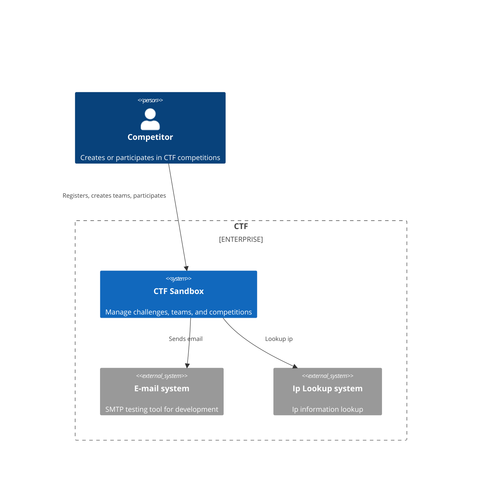
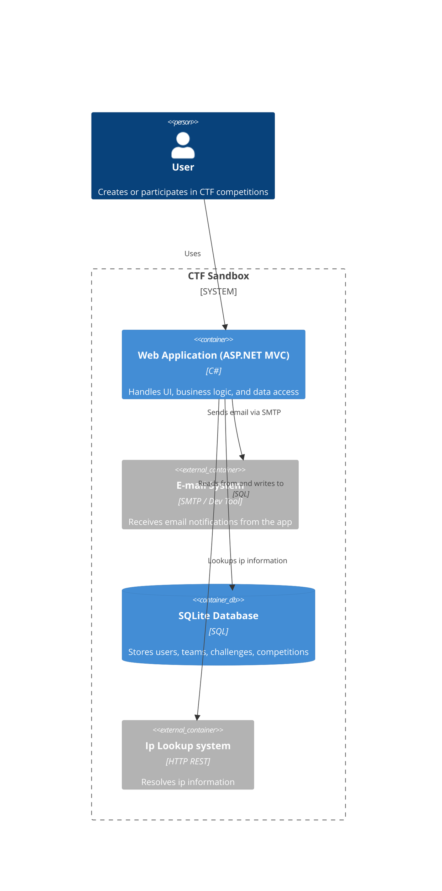

# 🚦 Pipeline Dashboard

| Pipeline        |
|-----------------|
[](https://github.com/CurlyFire/ctf-sandbox/actions/workflows/commit-stage.yml) |
[](https://github.com/CurlyFire/ctf-sandbox/actions/workflows/acceptance-stage.yml) |
[](https://github.com/CurlyFire/ctf-sandbox/actions/workflows/qa-stage.yml) |
[](https://github.com/CurlyFire/ctf-sandbox/actions/workflows/qa-signoff.yml) |
[](https://github.com/CurlyFire/ctf-sandbox/actions/workflows/production-stage.yml) |

# System Name
ctf-sandbox

# Contributors
- [Stéphane Denommé](https://github.com/CurlyFire)
- [Valentina (Cupać) Jemuović](https://github.com/valentinajemuovic)

# Project Board
https://github.com/users/CurlyFire/projects/4/views/1

# Licence
MIT

# Background Context
This is a TDD Sandbox to work out the kinks to migrate from a big ball of mud legacy project to a microservice hexagonal architecture with unit tests that respect the modern test pyramid.

The main goals of this project are:
- ✅ Generate a big ball of mud to represent the initial legacy application
- 🔄 Migrate to a microservices hexagonal architecture with unit tests
- 🔄 Get my DDD Bounded Contexts framed correctly
- 🔄 Develop all this code in TDD, following [Valentina Jemuovic's](https://github.com/valentinajemuovic) suggested way.  Her site is [Optivem journal](https://journal.optivem.com).  You can also follow her on [LinkedIn](https://www.linkedin.com/in/valentinajemuovic)

## Artificial intelligence
The big ball of mud was created with github copilot agent mode using Claude Sonnet 3.5.  I just wanted to create something that worked without being clean.

# [System behavior](docs/systembehavior.md)

# System structure

## Architecture style
MVC monolith

## Architecture diagrams

### System context diagram


### Container diagram

# Environments
| Environment | Status | Link |
|-------------|--------|------|
| QA          | [](https://github.com/CurlyFire/ctf-sandbox/actions/workflows/qa-stage.yml) | https://mvc-app-qa-663949819005.us-central1.run.app
| Production  | [](https://github.com/CurlyFire/ctf-sandbox/actions/workflows/production-stage.yml) | https://mvc-app-prod-663949819005.us-central1.run.app

The CTF competition UI has all the features mentionned in the Sytem use cases section.  Mailpit is used as a SMPT server for invitations and registrations, however, the emails all stay there and can be seen from the mailpit UI.  If you require access to it, ask me and I will create a user for you to view all emails.

# External systems
Each environment has it's own external system docker container instances.  The test environments (acceptance, E2E, docker-compose) also have their own external test instances, however they are ephemeral and last only for the duration of the tests, so no links are provided here.

|             | Real                     |Stubbed                   |
|-------------|--------------------------|--------------------------|
| Email       | Mailpit Docker container | Mailpit Docker container |
| Ip info     | https://ipinfo.io        | WireMock                 |
| Time        | System clock             | WireMock                 |

## Configuring real vs stubbed
### Email
As the protocols to communicate are smtp and http, to switch between real or stubbed, you only have to change the Email settings described in the [Configuring external system connections](#configuring-external-system-connections) section.

### Ip info
as the protocol to communicate is http, to switch between real or stubbed, you only have to change the Ipinfo settings described in the [Configuring external system connections](#configuring-external-system-connections) section.

### Time
The contract used to get the current time is through the abstract class System.TimeProvider.  To switch between real or stubbed, you only have to change the configuration settings between the system or http TimeProvider, like this:

```json
{
  # Use these settings to use the system clock
  "TimeProvider": {
    "Type": "system"
  }
  # OR use these settings to use a stubbed WireMock provider that returns the time as a utc string
  "TimeProvider": {
    "Type": "http",
    "Url": "http://wiremockserver/api/time"
  },  
}

```
## Links to external systems
| Environment | External system | Link |
|-------------|-----------------|------|
| QA          | Mailpit | https://mailpit-ui-qa-663949819005.us-central1.run.app/ |
| Production  | Mailpit | https://mailpit-ui-prod-663949819005.us-central1.run.app/ |

## Configuring external system connections
To configure which external system is used by the mvc-app, override the following configurations using either appsettings.web.json or environment variables as explained in this article https://learn.microsoft.com/en-us/aspnet/core/fundamentals/configuration/?view=aspnetcore-9.0
It is suggested to override through the appsettings.web.dev.json, as this file is git ignored, but is optionaly read by the application, and has a higher
priority than appsettings.web.json

example with appsettings.json

```json
{
  "EmailSettings": {
    # Change these values to connect to a different mailpit instance
    "SmtpServer": "mailpit",
    "SmtpPort": 1025,
    "MailpitUrl": "http://localhost:8025"
  },
  "IPInfo": {
    # Change these values to connect to a different ipinfo instance
    "Token": "MySecretToken",
    "BaseUrl": "https://ipinfo.io"
  },  
}

```

## Tech stack
Programming language: C#

Frameworks: ASP.Net Core MVC

Database: Sqlite

## Repository Strategy
Mono-Repo

# Deployment
CI/CD is enabled for the main branch and will deploy to the Acceptance environement automatically.

## Team Roles
### Developers
Responsible for writing the software and maintaining the PageObjectModels and Tests.

### QA
Responsible for writing addditional E2E tests.

# Contribute
## Software requirements
### Windows
- [Windows Subsystem for Linux](https://learn.microsoft.com/en-us/windows/wsl/install)
- [Docker desktop](https://www.docker.com/products/docker-desktop/)
- [Visual Studio Code](https://code.visualstudio.com/)
    - [Dev containers extension](https://marketplace.visualstudio.com/items?itemName=ms-vscode-remote.remote-containers)

## Local system startup
- Make sure you have installed the software requirements
- Clone the repository
- Open the cloned folder
- Reopen the folder inside a devcontainer (Visual Studio's Dev container extension should detect the devcontainer configuration)
- Everything needed to build and run is configured inside the devcontainer with docker compose.  Just press F5 and the debug task will start the application
- If you wish to work on pipelines locally, make sure to run dev-scripts/authenticate.ps1, as this will authenticate you to gcloud and github

## Local system shutdown
- Close Visual Studio code
- Stop the containers in Docker desktop or close Docker desktop