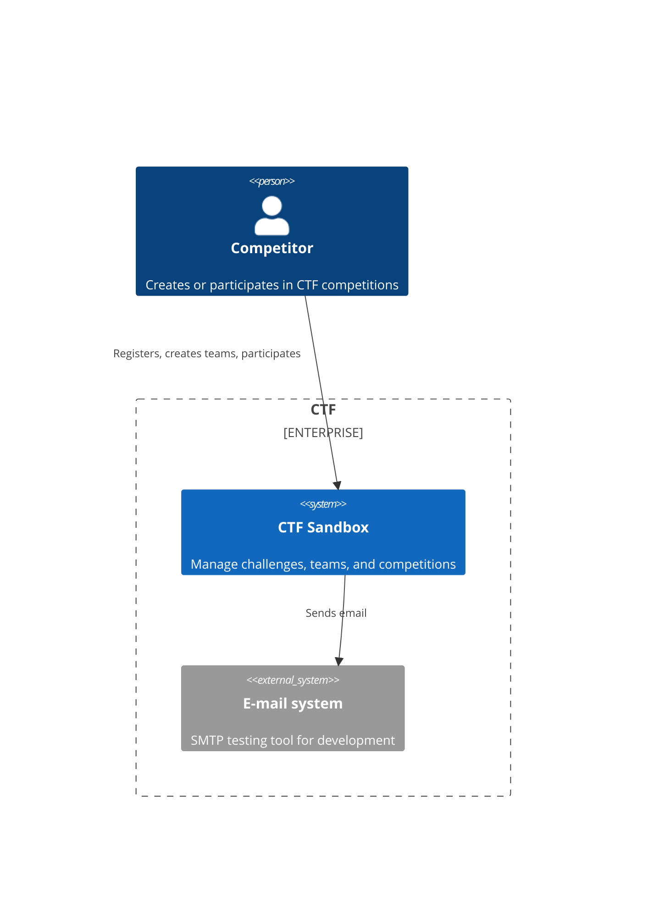
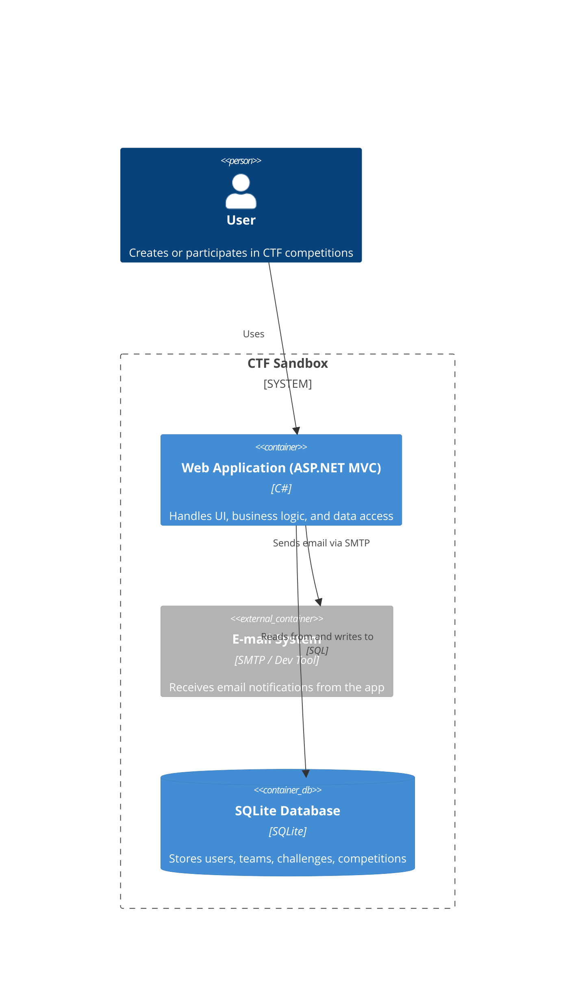

# System Name
ctf-sandbox

# Contributors
- [Stéphane Denommé](https://github.com/CurlyFire)

# Licence
MIT

# Background Context
This is a TDD Sandbox to work out the kinks to migrate from a big ball of mud legacy project to a microservice hexagonal architecture with unit tests that respect the modern test pyramid.

The main goals of this project are:
- ✅ Generate a big ball of mud to represent the initial legacy application
- 🔄 Migrate to a microservices hexagonal architecture with unit tests
- 🔄 Get my DDD Bounded Contexts framed correctly
- 🔄 Develop all this code in TDD, following [Valentina Jemuovic's](https://github.com/valentinajemuovic) suggested way.  Her site is [Optivem journal](https://journal.optivem.com).  You can also follow her on [LinkedIn](https://www.linkedin.com/in/valentinajemuovic)

## Artificial intelligence
The big ball of mud was created with github copilot agent mode using Claude Sonnet 3.5.  I just wanted to create something that worked without being clean.

## 🚦 Pipeline Dashboard

### Component stages
| Component       | Commit Stage Status |
|-----------------|---------------------|
| ctf-sandbox     |  |

### System stages
|        | UAT Stage | Production Stage |
|--------|-----------|------------------|
| System |  |  |

# System use cases
- As a competitor or challenge creator, I want to sign up for future CTF competitions
- As a competitor, I want to create a team of competitors
- As a team leader, I want to assign competitors to my team
- As a team leader, I want to particate in a CTF competition
- As a challenge creator, I want to create CTF challenges
- As a CTF organizer, I want to create upcoming CTF competitions
- As a CTF organizer, I want to assign challenges to an upcoming CTF competition
- As a CTF organizer, I want to assign teams to an upcoming CTF competition

# External systems
- Email using [mailpit](https://mailpit.axllent.org/)
- System clock

# System architecture style
MVC monolith

# Architecture diagrams

## System context diagram

## Container diagram

# Tech stack
Programming language: C#

Frameworks: ASP.Net Core MVC

Database: Sqlite

# Repository Strategy
Mono-Repo

# Branching Strategy
Feature Branching

# Deployment Model
Google cloud platform

# Pipeline Tool
Github Actions

# Docker Registry
Google Cloud Artifact Registry

# Project Board
https://github.com/users/CurlyFire/projects/4/views/1

# Environments
| Environment | Status | Link |
|-------------|--------|------|
| UAT         |  | https://mvc-app-uat-663949819005.us-central1.run.app
| Production  |  | https://mvc-app-production-663949819005.us-central1.run.app

The CTF competition UI has all the features mentionned in the Sytem use cases section.  Mailpit is used as a SMPT server for invitations and registrations, however, the emails all stay there and can be seen from the mailpit UI.  If you require access to it, ask me and I will create a user for you to view all emails.

# Deployment
CI/CD is enabled for the main branch and will deploy to the Acceptance environement automatically.

## Manual testing
[Procedure](docs/manualtesting.md)

# Contribute
## Software requirements
### Windows
- [Windows Subsystem for Linux](https://learn.microsoft.com/en-us/windows/wsl/install)
- [Docker desktop](https://www.docker.com/products/docker-desktop/)
- [Visual Studio Code](https://code.visualstudio.com/)
    - [Dev containers extension](https://marketplace.visualstudio.com/items?itemName=ms-vscode-remote.remote-containers)

## Setup
- Clone the repository
- Open the cloned folder
- Reopen the folder inside a devcontainer (Visual Studio should detect the devcontainer configuration)
- Everything needed to build and run is configured inside the devcontainer.  Just press F5
