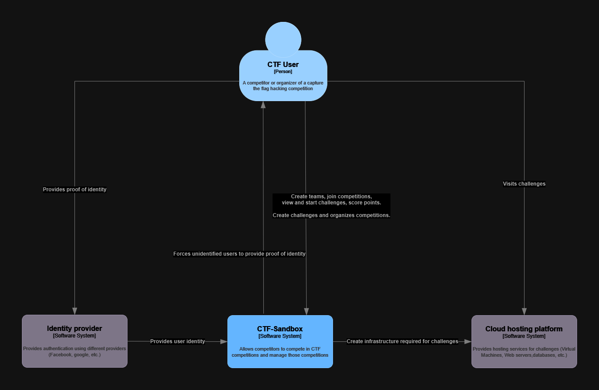
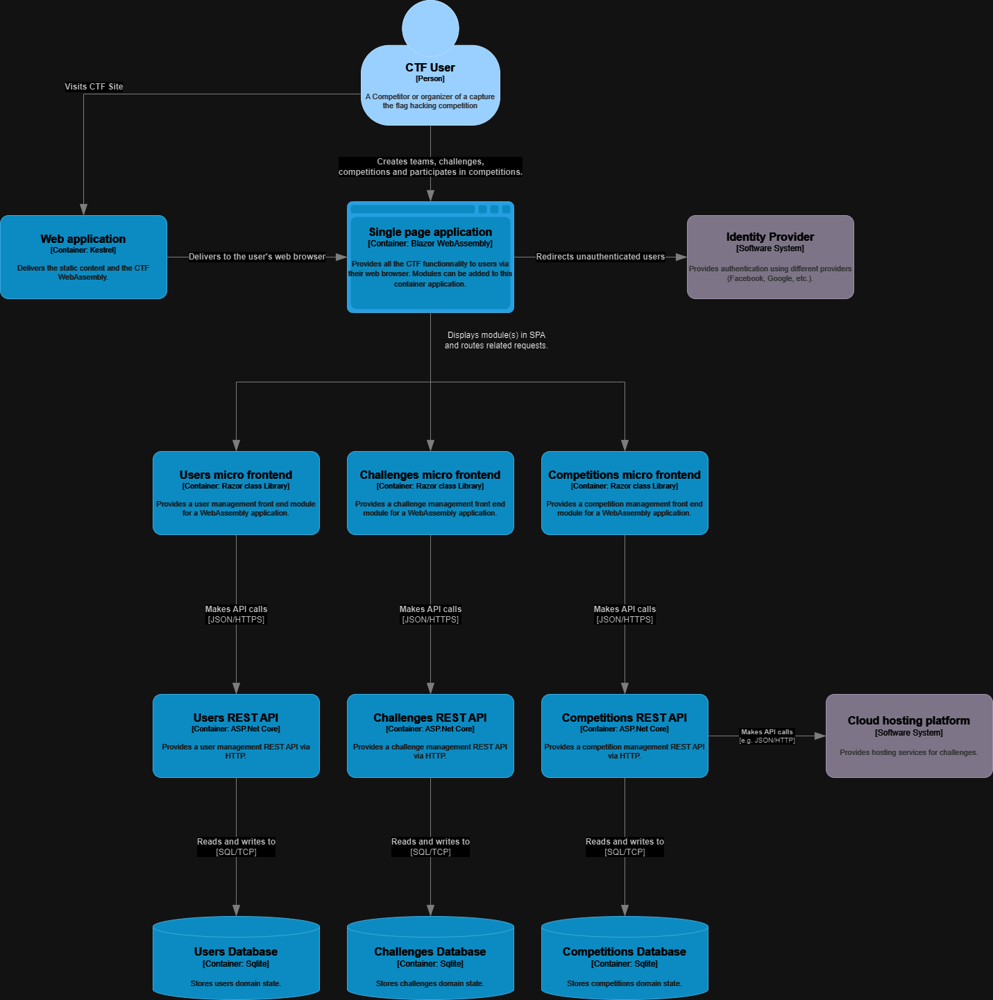

## System Name
ctf-sandbox

## Contributors
- [Stéphane Denommé](https://github.com/CurlyFire)

## Licence
MIT

## Background Context
This is a TDD Sandbox to shake out the kinks in an upcoming open source project that will modernize CTF competition softwares.  

The main goals of this project are:
- Get my DDD Bounded Contexts framed correctly
- Implement those bounded contextes in a hexagonal architecture
- Adapt those contexts with REST adapters, preferably with hypermedia
- Develop all this code in TDD, following [Valentina Jemuovic's](https://github.com/valentinajemuovic) suggested way.  Her site is [Optivem journal](journal.optivem.com).  You can also follow her on [LinkedIn](https://www.linkedin.com/in/valentinajemuovic)

## System use cases
- As a competitor, I want to sign up for future CTF competitions
- As a competitor, I want to create a team of competitors
- As a team leader, I want to assign competitors to my team
- As a team leader, I want to particate in a CTF competition
- As a challenge creator, I want to create CTF challenges
- As a CTF organizer, I want to create upcoming CTF competitions
- As a CTF organizer, I want to assign challenges to an upcoming CTF competition

FURTHER USE CASES WILL PROBABLY BE ADDED IN THE OPEN SOURCE PROJECT

## External systems
- [Azure Rest API](https://learn.microsoft.com/en-us/rest/api/azure/)
- Azure identity provider
- System clock

## System architecture style
Micro Frontends + Micro Services

## Architecture diagrams

### System context diagram

### Container diagram

## Tech stack
Programming language: C#

Frameworks: Blazor Web Assembly, ASP.Net Core

Database: Sqlite

Message Broker: ***Upcoming...***

## Repository Strategy
Multi-Repo

## Branching Strategy
Feature Branching

## Deployment Model
Microsoft Azure

## Repositories
[ctf-sandbox-frontend](https://github.com/CurlyFire/ctf-sandbox-frontend)

Contains the main container application.  It's responsiblity is to authenticate users, display modules and to redirect requests to the underlying modules.

[ctf-sandbox-users-frontend](https://github.com/CurlyFire/ctf-sandbox-users-frontend)

Contains the users front end module.  It's responsiblity is to display all available functions for the users domain.

[ctf-sandbox-users](https://github.com/CurlyFire/ctf-sandbox-users)

Contains the users back end.  It's responsiblity is to provide functions for the users domain.
