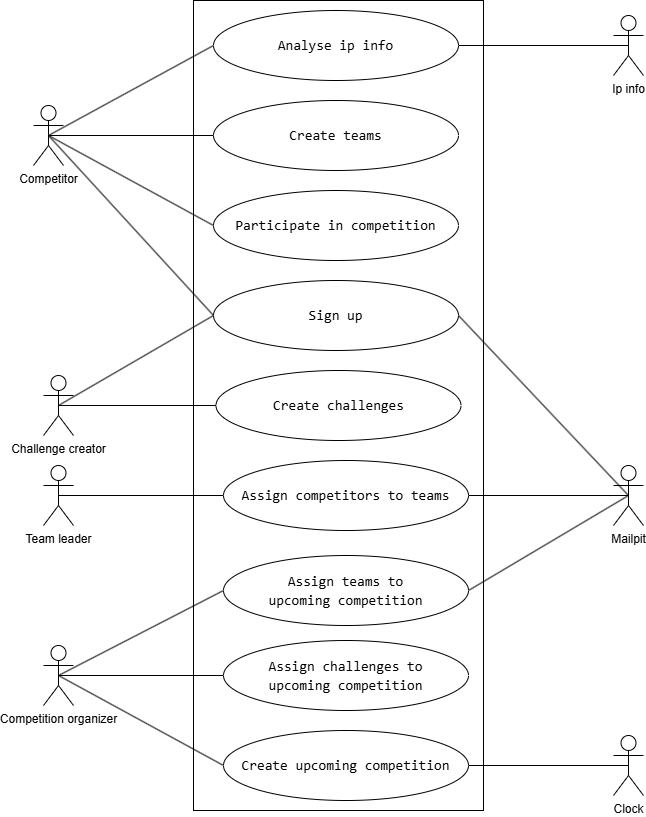

## Use Case Diagram

Primary Actors:
- Competitor
- Team leader
- Challenge creator
- Competition organizer

Use Cases:
- Sign up
- Create teams
- Assign competitors to teams
- Participate in competition
- Create challenges
- Create upcoming competition
- Assign challenges to upcoming competition
- Assign teams to upcoming competition
- Analyse ip info

Secondary Actors:
- Mailpit (Email)
- Ip Info
- Clock

## Use Case Narrative: Sign up for a CTF Competition

### Use Case Name
Sign up for a CTF Competition

### Primary Actor
Competitor or Challenge creator

### Goal
The user should be able to access the system's protected functions.

### Preconditions
- The user has an email address.

### Main Success Scenario
1. The user begins registering a new account
2. The user enters a email
3. The user enters a password
4. The user confirms the password
5. The user registers the new account
6. The system validates the email
7. The system validates the password
8. The system creates a temporary account
9. The system sends a verification message to the email

### Extensions (Alternative Flows)
- 6a. Non-valid email:
    - The system notifies the user and suggests entering a valid email.
- 7a. Non-valid password:
    - The system notifies the user and suggests entering a valid password.
- 9a. email not available:
    - The system notifies the user that the email system is not available at this time.

### Postconditions
- The account is temporarily created and stored in the system.
- The user receives an verification email.

## Use Case Narrative: Confirm account

In a Real Life Project, we would write Use Case Narratives for the other Use Cases too. In this Sandbox Project, I've omitted writing the other Use Cases.
